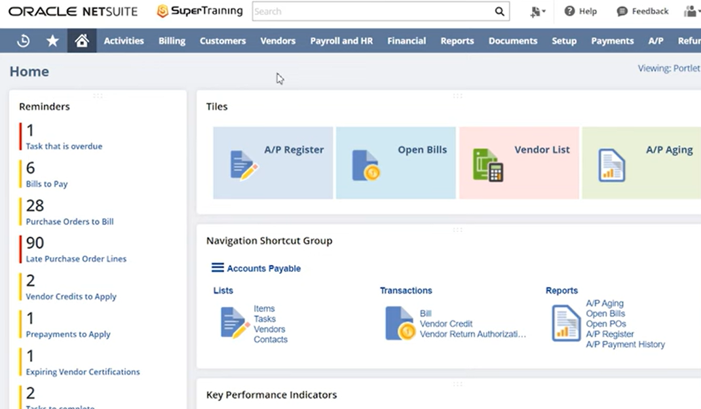

# NetSuite Administration – Day 1

This repository demonstrates hands-on exploration of NetSuite administration concepts using publicly available tutorial videos. Screenshots were captured for educational purposes to illustrate core UI components and navigation.

## Screenshots

### Dashboard

- Overview of dashboard widgets, KPIs, and quick links
- Top navigation menu visible

### Customer Record

- Fields include contact info, company details, and associated transactions
- Demonstrates access to customer records via Lists → Relationships → Customers

### Transaction Record

- Shows transaction details (Invoice / Order / Bill)
- Links customer and item information

### Global Search

- Demonstrates the global search bar for quick access to any record

## Day 2 – Roles, Permissions, and Access Control

### Roles Overview

- NetSuite roles define access to records, transactions, and system features
- Roles are customized based on job function and operational responsibilities
- Supports role-based access control (RBAC) and least-privilege access models

### Role Permissions

- Permissions are assigned per role with defined access levels (View, Create, Edit, Full)
- Demonstrates granular access control and separation of duties
- Aligns with enterprise identity governance and compliance practices

### Role-Based Dashboard – Role 1

- Dashboard customized for a specific operational role
- Displays role-relevant KPIs, reports, and navigation options
- Limits exposure to unnecessary or sensitive data

### Role-Based Dashboard – Role 2

- Dashboard view after switching to a different role
- Demonstrates how NetSuite dynamically adjusts UI and data visibility
- Reinforces role-based access enforcement and usability

### User Role Assignment

- Users may be assigned multiple roles based on job responsibilities
- Active role determines access context within NetSuite
- Supports job rotation, dual responsibilities, and controlled privilege elevation
